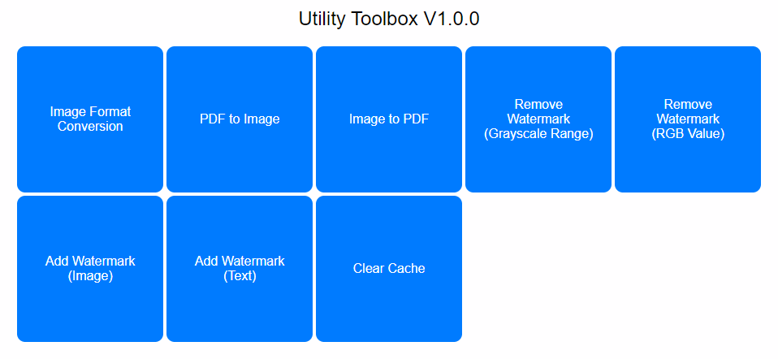

# Utility Toolbox
A toolbox that combines functionalities such as image conversion, PDF to image conversion, merging images into PDF, removing watermarks from images, and adding watermarks to images. Developed using Node.js and Python, it can be easily deployed locally. The interface is clean and intuitive, making it very user-friendly. The frontend is built using HTML, CSS, and JavaScript, while the backend is built using Node.js and Express. Python scripts are called to handle image and PDF files. **This project is almost entirely implemented using Prompt Engineering**  
  
## Main Features
1. Image format conversion  
2. PDF to image conversion  
3. Image to PDF conversion  
4. Image watermark removal  
5. Image watermark addition  
## How to Use?
0. Install Python 3.11.4 and Node.js 18.16.1.  
1. Double-click on `install.cmd` to run the installation script, which will automatically create a Python virtual environment and install the necessary dependencies.  
2. Double-click on `start.cmd` to run the startup script, which will automatically open the toolbox page in your browser.  
3. Close the terminal when you're finished.  
4. If you accidentally close the browser during use, you can run `start.cmd` again or enter `http://127.0.0.1:8080` in your browser.  
5. If there is a port conflict, you can modify the value of `PORT` in the `.env` file and then restart to change the port number.  

## Technologies Used
### Frontend
HTML, CSS, CSS Grid, JavaScript, Fetch API, DOM, Promise, Async/Await, FormData  
### Backend
#### Node.js
Express.js (Web application framework), Routing, dotenv module (Load environment variables), archiver module (Create ZIP files), multer module (File upload), sharp module (Node.js image processing), Promise (Handle asynchronous operations), child_process module (Execute system commands using exec function), JSON  
#### Python
poppler (Handle PDF files), fpdf module (Handle PDF files), pdf2image module (Convert PDF to images), PIL module (Image processing)  